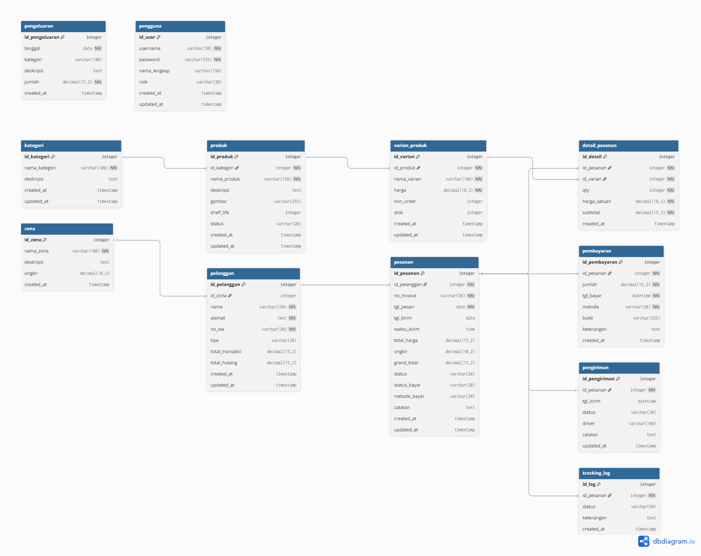

# 📚 Berkat Dinasti - Map of Content (MOC)

Selamat datang di pusat dokumentasi **Sistem Informasi Berkat Dinasti**. File ini bertindak sebagai *Home* atau *Map of Content* (MOC) untuk memudahkan kamu bernavigasi menggunakan **Obsidian** (memanfaatkan *wiki-links*).

## 🗂️ Laporan & Dokumen Utama
- [[Kelompok 5_Laporan UI_UX (FINAL)]] - Laporan akhir untuk desain UI/UX.
- [[Kelompok 5_Laporan UI_UX]] - Draft laporan UI/UX sebelumnya.
- [[Kelompok 5_Laporan DFD]] - Laporan utuh mengenai Data Flow Diagram (DFD) dan Analisis Sistem.
- [[PANDUAN_PRESENTASI_SLIDE]] - Panduan, struktur slide, dan narasi untuk presentasi proyek.
- [[InterviewMitra_Kelompok5.pdf]] - Dokumen Hasil Wawancara dengan Mitra.

## 📊 Diagram & Struktur
- [[DFD_Berkat_Dinasti]] - Penjelasan lengkap alur DFD.
- [[MERMAID_DFD_DIAGRAMS]] - Kode diagram DFD dalam format sintaks Mermaid (bisa di-render di Obsidian).
- [[Mermaid_Diagrams_Berkat_Dinasti]] - Diagram tambahan terstruktur dalam format Mermaid.
-  - Skema Entity Relationship Diagram (ERD).

## 📁 Sub-Direktori Tersedia
- **`dfd_docs_per_bab/`** : Laporan DFD yang sudah dipecah per bab agar lebih rapi dan ringan saat dibaca.
- **`UI UX/`** : Berisi desain sistem, typography (font Inter), dan panduan UI lainnya.
- **`../database/`** : Kalau kamu butuh referensi file SQL / skema database, semuanya ada di folder ini di luar `docs/`.

---
*Catatan AI (Antigravity): Jika ada konteks baru, kita bisa menambahkannya di sini agar Obsidian dan AI tetap berada di pemahaman yang sama.*
