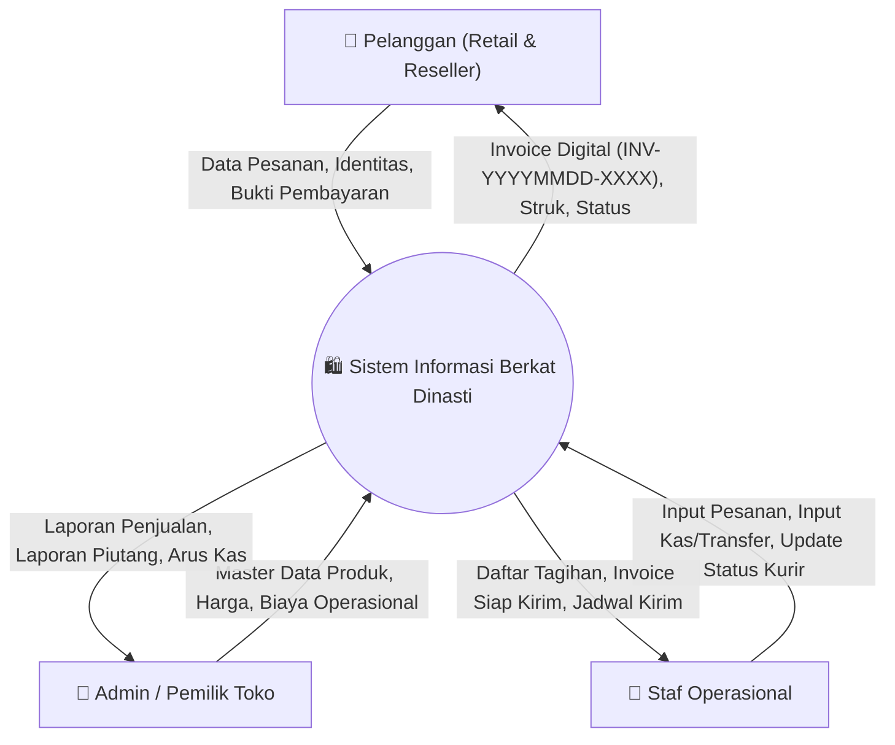

# 🏗️ Arsitektur Sistem & Data Flow Diagram (DFD) - Berkat Dinasti

Dokumen ini berisi spesifikasi arsitektur data, Data Flow Diagram (DFD Level 0, 1, dan 2), skema data store (Tabel T1–T13), serta matriks hak akses (*Role-Based Access Control*) untuk aplikasi **Sistem Informasi Berkat Dinasti**.

---

## 1. Context Diagram (DFD Level 0)

Sistem Informasi Berkat Dinasti mengintegrasikan seluruh transaksi operasional UMKM **Dynasty Food & Beverage** (penjualan roti *pre-order*) dengan 3 entitas eksternal utama:

### Entitas Eksternal
1. **Pelanggan (Retail & Reseller):** Sumber pesanan, penerima produk, invoice digital, dan bukti pembayaran.
2. **Admin / Pemilik:** Mengelola seluruh master data, aturan harga, laporan keuangan, dan hak akses akun.
3. **Staf Operasional:** Menginput pesanan harian, mencatat transaksi pembayaran (cash/transfer), dan memperbarui status pengiriman.

> ℹ️ **Catatan Pengiriman:** Seluruh pengiriman di area **Kota Malang dan Kota Batu** bersifat **GRATIS ONGKIR** (tanpa tarif zona).

---

## 2. DFD Level 1: Overview 7 Proses Utama

DFD Level 1 membagi sistem menjadi 7 sub-proses utama yang terhubung ke 7 kelompok Data Store (D1–D7):

| ID | Nama Proses Utama | Deskripsi Fungsional | Data Store Terlibat |
| :---: | :--- | :--- | :--- |
| **1.0** | **Manajemen Katalog Produk** | CRUD produk, kategori, varian kemasan, dan harga. | `D1: Produk & Katalog` |
| **2.0** | **Manajemen Pelanggan** | Pendataan pelanggan, klasifikasi (Retail/Reseller), piutang. | `D2: Data Pelanggan` |
| **3.0** | **Manajemen Pesanan** | Input pesanan, auto-generate invoice, status pesanan. | `D3: Pesanan` |
| **4.0** | **Manajemen Pembayaran** | Pencatatan DP/Lunas/Utang (Tunai/Transfer), struk digital. | `D4: Pembayaran & Tracking` |
| **5.0** | **Manajemen Pengiriman** | Penjadwalan kirim (Max 150 pcs/trip obrok), status kurir. | `D5: Pengiriman` |
| **6.0** | **Pelaporan Keuangan** | Rekap penjualan, biaya operasional, arus kas, ekspor PDF/Excel. | `D6: Keuangan & Kas` |
| **7.0** | **Manajemen Pengguna** | Autentikasi login (bcrypt, session 30 min), RBAC role. | `D7: Pengguna Sistem` |

---

## 3. Kamus & Pemetaan Data Store (Tabel T1 – T13)

Sistem menggunakan 13 tabel database fisik yang dipetakan ke kelompok Data Store D1–D7:

| Kode Tabel | Nama Tabel | Data Store | Fungsi & Keterangan Data |
| :---: | :--- | :---: | :--- |
| **T1** | `kategori` | D1 | Kategori roti (Roti Hajatan, Roti Manis, dll). |
| **T2** | `produk` | D1 | Master data produk (nama, masa simpan/shelf life, status). |
| **T3** | `varian_produk` | D1 | Kemasan (Kardus, Mika, Satuan), harga, minimum order (MOQ). |
| **T4** | `pelanggan` | D2 | Profil pelanggan retail & reseller, akumulasi `total_hutang`. |
| **T5** | `pesanan` | D3 | Header transaksi (`INV-YYYYMMDD-XXXX`), tanggal kirim, grand total. |
| **T6** | `detail_pesanan` | D3 | Rincian item roti dipesan, kuantitas, subtotal. |
| **T7** | `pembayaran` | D4 | Log transaksi pembayaran (nominal, metode bayar, bukti). |
| **T8** | `pengiriman` | D5 | Jadwal kurir & jam estimasi tiba (Gratis Malang & Batu). |
| **T9** | `tracking_log` | D4 / D5 | Audit trail perubahan status pesanan & pengiriman. |
| **T10** | `pengguna` | D7 | User internal (username, password hash bcrypt, role). |
| **T11** | `pengeluaran` | D6 | Biaya operasional (bahan baku, plastik, bahan bakar, utilitas). |
| **T12** | `transaksi_kas` | D6 | Arus kas riil masuk (inflow) & keluar (outflow). |
| **T13** | `setting` | All | Konfigurasi dinamis sistem. |

---

## 4. DFD Level 2: Detail Sub-Proses

### Siklus Status Pesanan (Logika Bisnis)
1. **Pending / Menunggu Konfirmasi:** Pesanan baru dibuat, menunggu pembayaran awal/konfirmasi admin.
2. **Proses Dapur:** Pesanan dikonfirmasi dan masuk antrean produksi.
3. **Siap Kirim / Diambil:** Produk selesai dikemas dan siap diantar kurir.
4. **Selesai / Batal:** Pesanan telah sampai di pelanggan dan pelunasan dikonfirmasi.

### Logika Otomatisasi Pembayaran & Piutang (Sub-proses 4.2 & 4.3)
$$\text{Total Dibayar} = \sum \text{Nominal Pembayaran}$$

$$\text{Status Bayar} = \begin{cases} \text{Lunas}, & \text{jika Total Dibayar} \ge \text{Grand Total} \\ \text{Hutang}, & \text{jika Total Dibayar} < \text{Grand Total} \end{cases}$$

$$\text{Sisa Piutang} = \text{Grand Total} - \text{Total Dibayar}$$
*Sisa piutang otomatis diakumulasikan ke kolom `total_hutang` pada tabel `pelanggan`.*

---

## 5. Matriks Hak Akses (Role-Based Access Control)

| Modul / Fitur Sistem | Admin (Pemilik) | Staf Operasional |
| :--- | :---: | :---: |
| **Master Produk & Katalog Harga** | **Full Access (CRUD)** | Akses Ditolak |
| **Master Data Pelanggan** | **Full Access (CRUD)** | View Only |
| **Input & Manajemen Pesanan** | **Full Access (CRUD)** | **Full Access (Input & Edit)** |
| **Pencatatan Kas & Pembayaran** | **Full Access (CRUD)** | **Full Access (Input Pembayaran)** |
| **Jadwal Pengiriman & Status Kurir**| **Full Access (CRUD)** | Input Jadwal & Update Status |
| **Laporan Keuangan & Arus Kas** | **Full Access (Export PDF/Excel)** | Terbatas (Rekap Kas Harian) |
| **Pengaturan Akun & Manajemen User**| **Full Access (Kelola User)** | Akses Ditolak |

---
*Dokumen ini merupakan bagian dari spesifikasi arsitektur final proyek Berkat Dinasti.*
