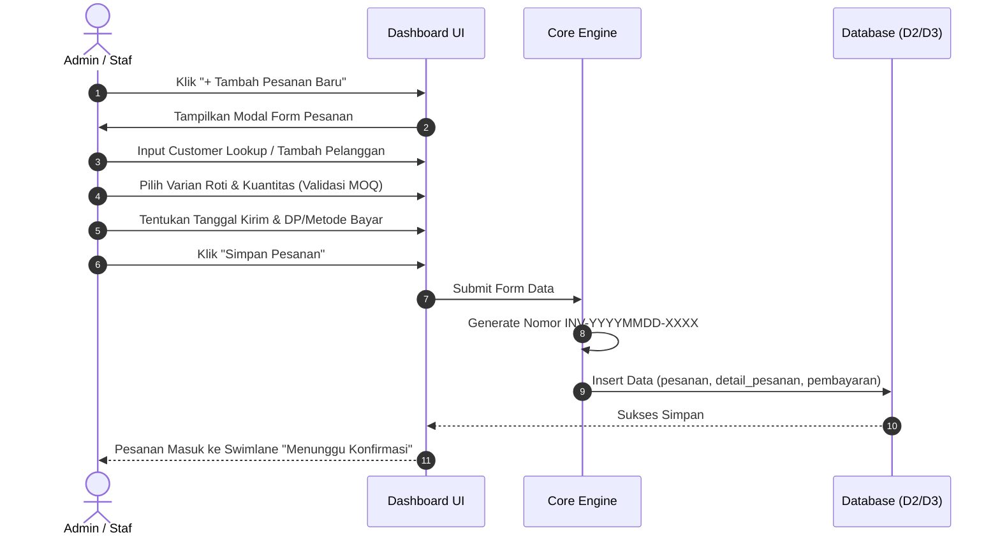

# 📦 Spesifikasi Fitur & Workflow Modul - Berkat Dinasti

Dokumen ini menjelaskan alur kerja fungsional (*workflow*), fitur-fitur utama, serta format data pada aplikasi **Sistem Informasi Berkat Dinasti**.

---

## 1. Peta Situs & Modul Utama (Site Map)

Aplikasi dibangun sebagai **Dashboard Internal Admin/Pemilik** (tanpa portal customer publik). Menu utama terbagi menjadi 7 modul:

1. **Dashboard (Beranda Utama)**
   - KPI Cards: Total Pesanan Hari Ini, Pesanan Pending, Total Pemasukan Bulan Ini, Pelanggan Baru.
   - Quick Action CTA: `+ Tambah Pesanan Baru`.
   - Widget Pesanan Perlu Tindakan & Ringkasan Dapur.
2. **Katalog Produk (`/produk`)**
   - KPI Cards Varian & Status Ketersediaan.
   - Tabel Master Produk & Varian Kemasan (Kardus, Mika, Satuan) + Minimum Order (MOQ).
   - Modal Tambah/Edit Produk.
3. **Manajemen Pesanan (`/pesanan`)**
   - Kanban Board 4 Swimlanes: `Menunggu Konfirmasi` ➔ `Proses Dapur` ➔ `Siap Kirim` ➔ `Selesai`.
   - Form Modal Input Pesanan dengan Customer Lookup & Auto Invoice Generator.
4. **Kalender Pengiriman (`/kalender`)**
   - Visualisasi Grid Kalender Pengiriman Harian/Bulanan.
   - Filter tanggal pesanan terdekat untuk pencegahan terlewatnya *deadline*.
5. **Manajemen Pelanggan / CRM (`/pelanggan`)**
   - Daftar Pelanggan (Retail vs Reseller) dengan saldo kewajiban `total_hutang`.
   - Tautan langsung WhatsApp & Riwayat Transaksi.
6. **Laporan & Keuangan (`/laporan`)**
   - Filter Periode (Bulanan & Custom Date Range).
   - Cards Ringkasan Omset, Completion Rate, Donut Chart Status Pembayaran (Lunas/Hutang).
   - Ekspor Laporan ke format PDF / Excel.
7. **Pengaturan & Manajemen User (`/pengaturan`)**
   - Profil UMKM & Uploader Logo.
   - POS Thermal Simulator (Preview Struk 80mm).
   - Manajemen User (Tambah Admin/Staf, Reset Password, Hapus User).

---

## 2. Format Penomoran & Aturan Data

### A. Generator Invoice Otomatis
Setiap pesanan baru akan secara otomatis mendapatkan nomor invoice unik dengan format standar:
$$\text{INV-} \mathbf{YYYYMMDD} \text{-} \mathbf{XXXX}$$
*Contoh:* `INV-20261001-0001` (Tanggal 1 Oktober 2026, urutan ke-1 hari itu).

### B. Kebijakan Pengiriman & Obrok
- **Bebas Ongkir:** Seluruh area pengiriman Kota Malang & Kota Batu disetel Rp 0 (tanpa zonasi).
- **Kapasitas Armada:** Sepeda motor obrok dibatasi **maksimal 150 pcs roti besar per perjalanan (trip)**.

---

## 3. Alur Kerja Pengguna (User Flows)

### Flow 1: Input Pesanan Baru

### Flow 2: Pemantauan Deadline Pengiriman
1. Admin membuka menu **Kalender Pengiriman**.
2. Tanggal dengan antrean pesanan aktif di-highlight dengan indikator jumlah pcs.
3. Admin mengklik tanggal tertentu untuk melihat daftar rincian pesanan yang harus dikirim hari itu.
4. Admin dapat langsung memperbarui status pengiriman dari kalender.

---
*Dokumen ini merupakan panduan spesifikasi fitur aplikasi Berkat Dinasti.*
