# 🎨 KUMPULAN KODE LENGKAP DIAGRAM DFD (MERMAID.JS)
## Sistem Informasi Manajemen Pesanan Roti — Berkat Dinasti

File ini berisi seluruh kode diagram Mermaid dari **Bab 1 sampai Bab 4**.
Tinggal copy kode blok yang kamu inginkan, lalu paste ke **[mermaid.live](https://mermaid.live)** -> Klik **Actions** -> **Copy Image** atau **Download PNG**.

---

# 📑 DAFTAR ISI DIAGRAM:
1. **BAB 1:** [Diagram 1.1] DFD Level 0 — Context Diagram
2. **BAB 2:** [Diagram 2.1] DFD Level 1 — Overview Diagram (7 Proses Utama & Data Store)
3. **BAB 3 (BAGIAN 1):**
   - [Diagram 3.1] DFD Level 2 — Proses 1.0 (Manajemen Katalog Produk)
   - [Diagram 3.2] DFD Level 2 — Proses 2.0 (Manajemen Pelanggan)
   - [Diagram 3.3] DFD Level 2 — Proses 3.0 (Manajemen Pesanan)
   - [Diagram 3.3B] Siklus Hidup Status Pesanan
4. **BAB 3 (BAGIAN 2):**
   - [Diagram 3.4] DFD Level 2 — Proses 4.0 (Manajemen Pembayaran)
   - [Diagram 3.5] DFD Level 2 — Proses 5.0 (Manajemen Pengiriman)
   - [Diagram 3.6] DFD Level 2 — Proses 6.0 (Pelaporan Keuangan)
   - [Diagram 3.7] DFD Level 2 — Proses 7.0 (Manajemen Pengguna)
5. **BAB 4:**
   - [Diagram 4.1] Ringkasan Arus Data Utama Sistem (Global Summary)

---

## 📌 BAB 1 — DIAGRAM 1.1: DFD LEVEL 0 (CONTEXT DIAGRAM)
> **Untuk:** Bab 1 Pendahuluan & Context Diagram

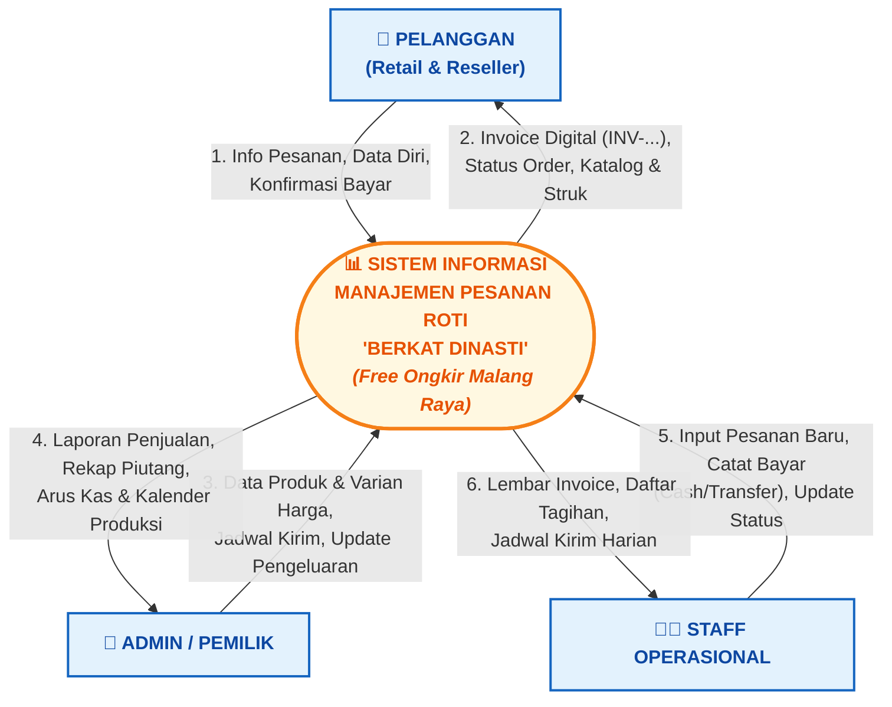

---

## 📌 BAB 2 — DIAGRAM 2.1: DFD LEVEL 1 (OVERVIEW DIAGRAM)
> **Untuk:** Bab 2 Overview Diagram & Kamus Data Store

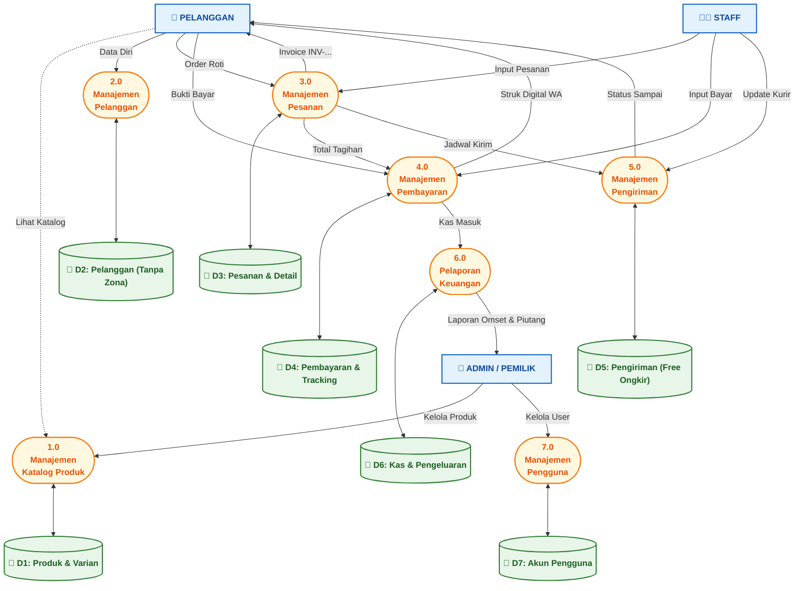

---

## 📌 BAB 3 (BAGIAN 1) — DIAGRAM 3.1: DFD LEVEL 2 (PROSES 1.0 KATALOG PRODUK)
> **Untuk:** Bab 3 Sub-bab 1 — Manajemen Katalog Produk

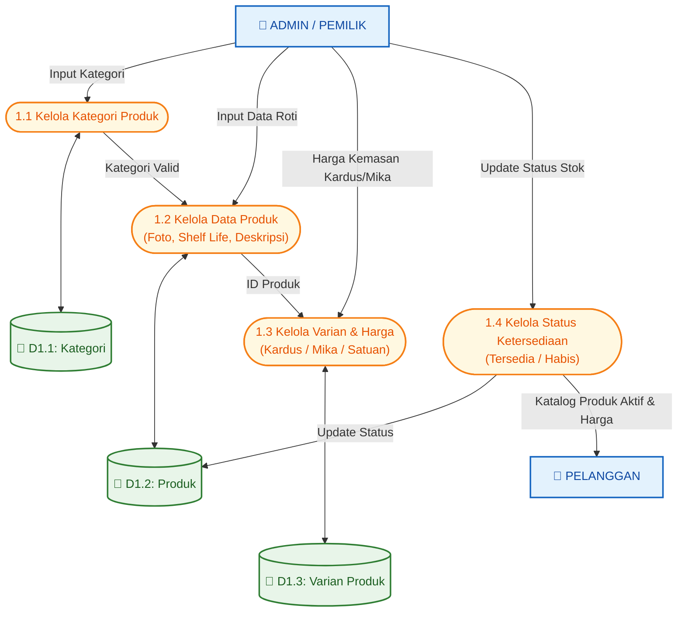

---

## 📌 BAB 3 (BAGIAN 1) — DIAGRAM 3.2: DFD LEVEL 2 (PROSES 2.0 MANAJEMEN PELANGGAN)
> **Untuk:** Bab 3 Sub-bab 2 — Manajemen Pelanggan (Retail/Reseller Tanpa Zona)

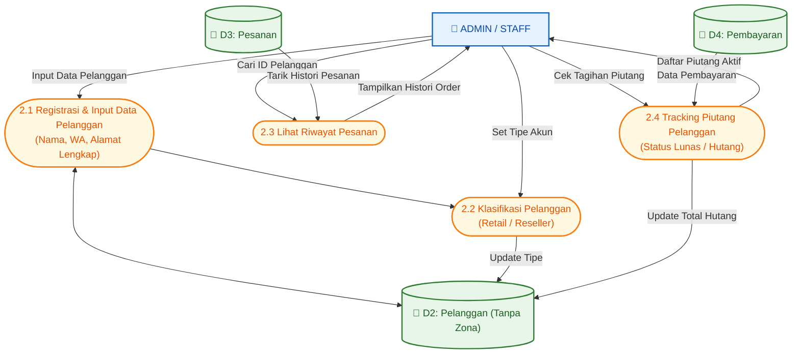

---

## 📌 BAB 3 (BAGIAN 1) — DIAGRAM 3.3: DFD LEVEL 2 (PROSES 3.0 MANAJEMEN PESANAN)
> **Untuk:** Bab 3 Sub-bab 3 — Manajemen Pesanan & Auto Invoice

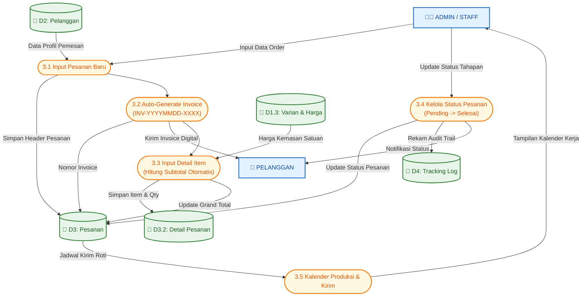

---

## 📌 BAB 3 (BAGIAN 1) — DIAGRAM 3.3B: ALUR STATUS PESANAN (STATE FLOW)
> **Untuk:** Bab 3 — Diagram Alur Siklus Hidup Pesanan

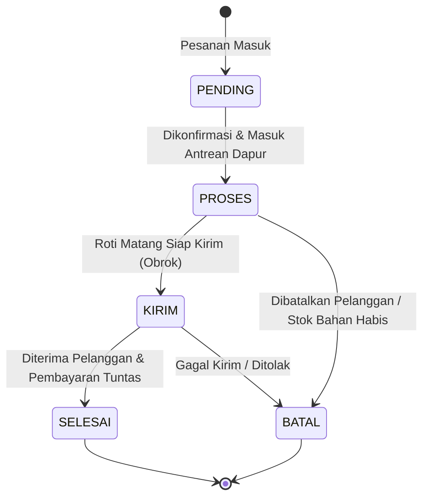

---

## 📌 BAB 3 (BAGIAN 2) — DIAGRAM 3.4: DFD LEVEL 2 (PROSES 4.0 MANAJEMEN PEMBAYARAN)
> **Untuk:** Bab 3 Sub-bab 4 — Manajemen Pembayaran (Lunas / Hutang)

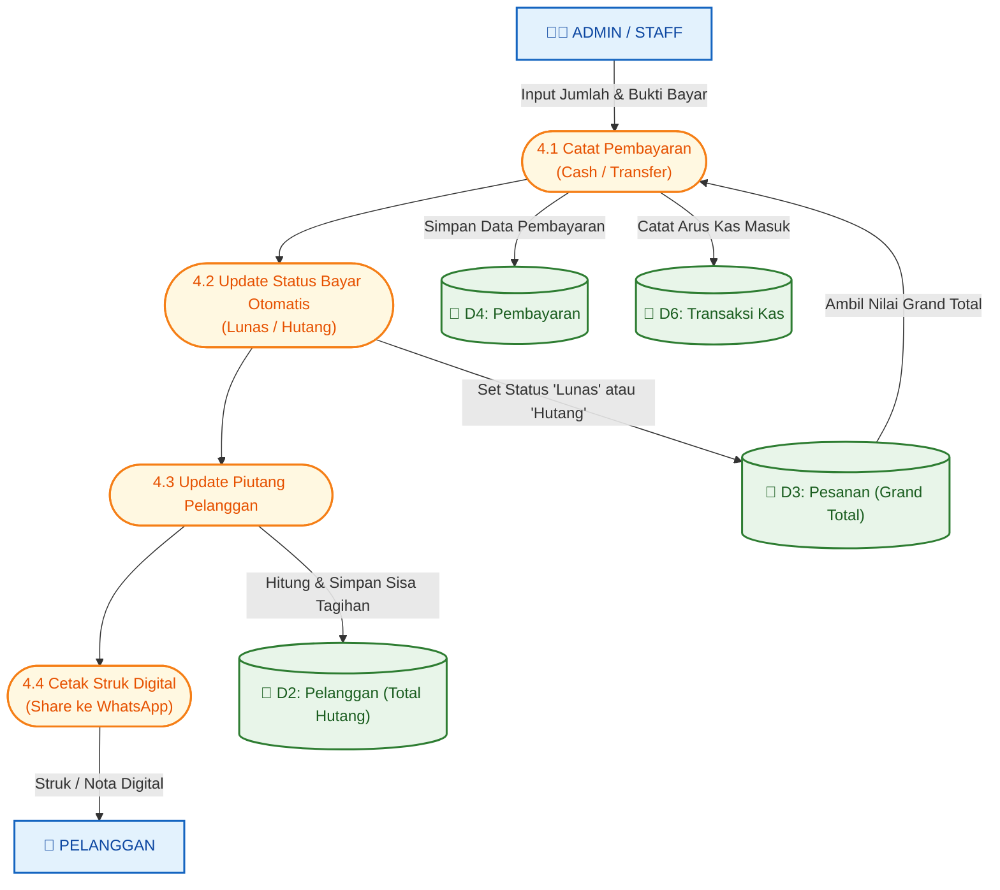

---

## 📌 BAB 3 (BAGIAN 2) — DIAGRAM 3.5: DFD LEVEL 2 (PROSES 5.0 MANAJEMEN PENGIRIMAN)
> **Untuk:** Bab 3 Sub-bab 5 — Manajemen Pengiriman (Free Ongkir Malang Raya, Obrok 150 pcs)

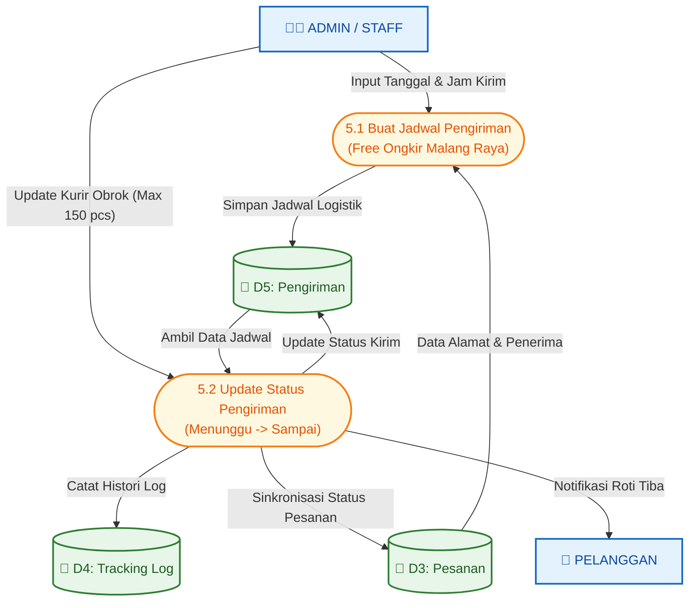

---

## 📌 BAB 3 (BAGIAN 2) — DIAGRAM 3.6: DFD LEVEL 2 (PROSES 6.0 PELAPORAN KEUANGAN)
> **Untuk:** Bab 3 Sub-bab 6 — Pelaporan Keuangan & Arus Kas

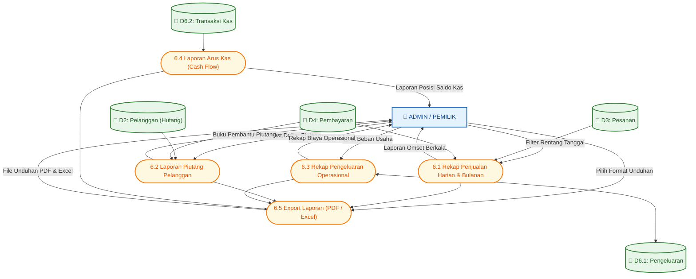

---

## 📌 BAB 3 (BAGIAN 2) — DIAGRAM 3.7: DFD LEVEL 2 (PROSES 7.0 MANAJEMEN PENGGUNA)
> **Untuk:** Bab 3 Sub-bab 7 — Manajemen Pengguna & Keamanan Sistem

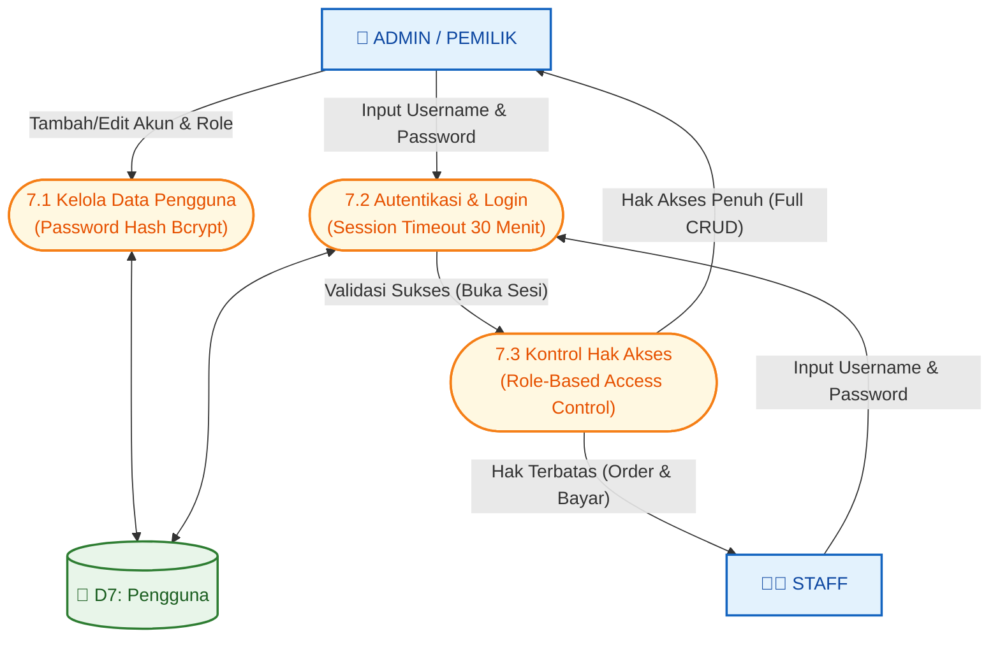

---

## 📌 BAB 4 — DIAGRAM 4.1: RINGKASAN ARUS DATA UTAMA (GLOBAL SUMMARY)
> **Untuk:** Bab 4 Ringkasan & Validasi Mitra

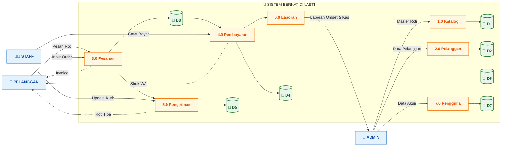
