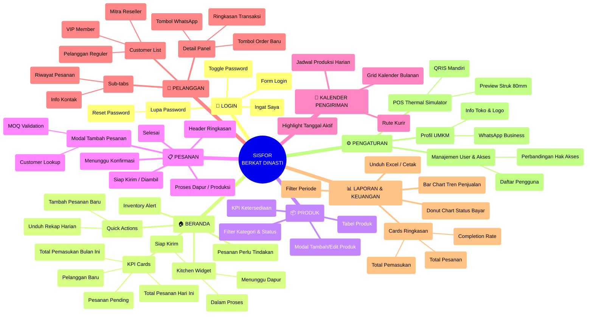
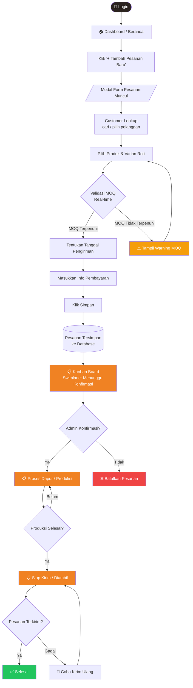
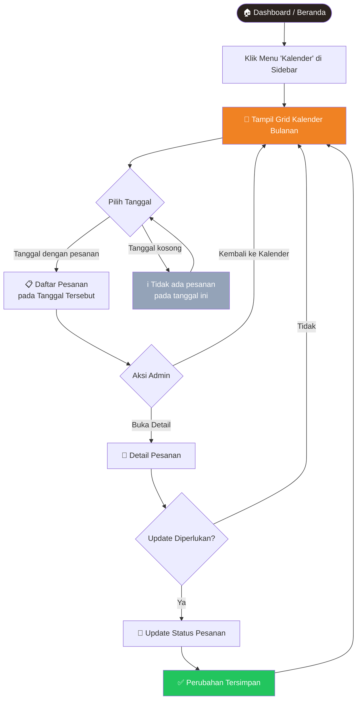
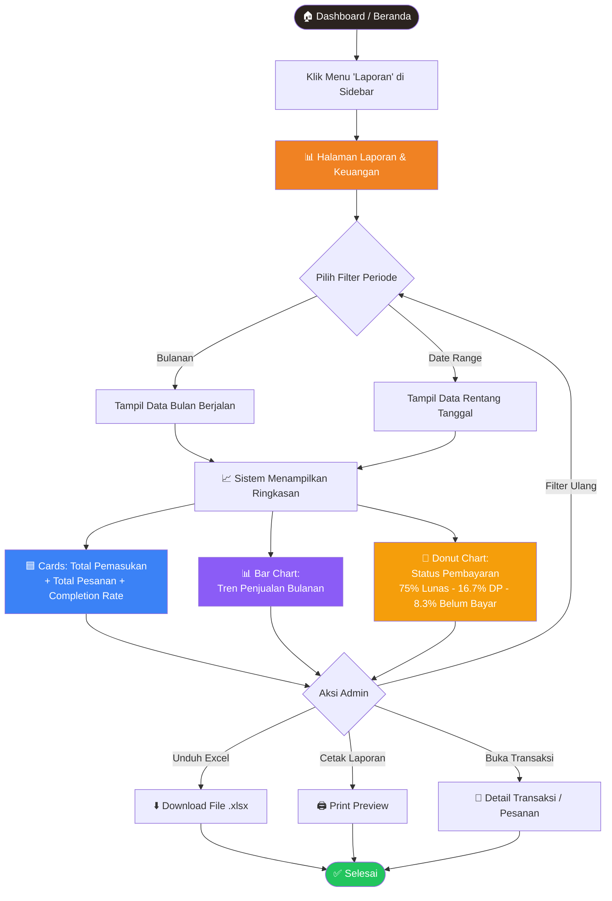
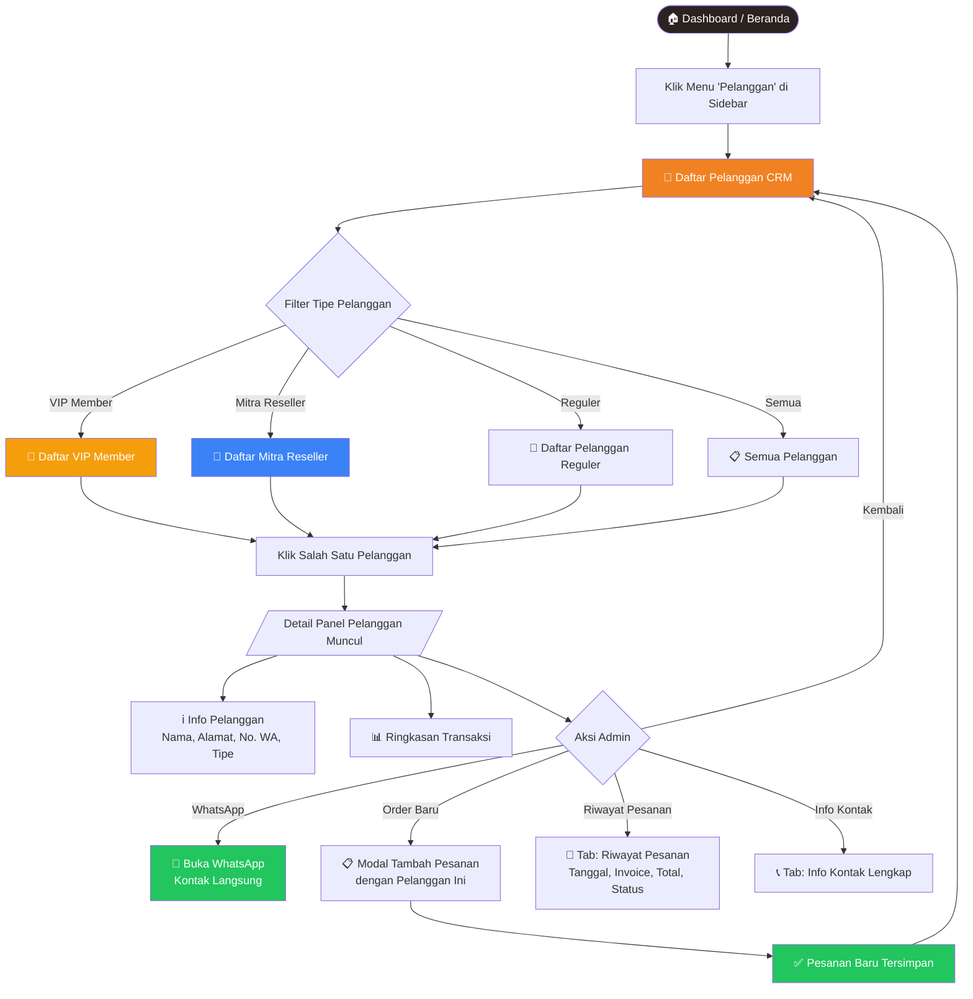
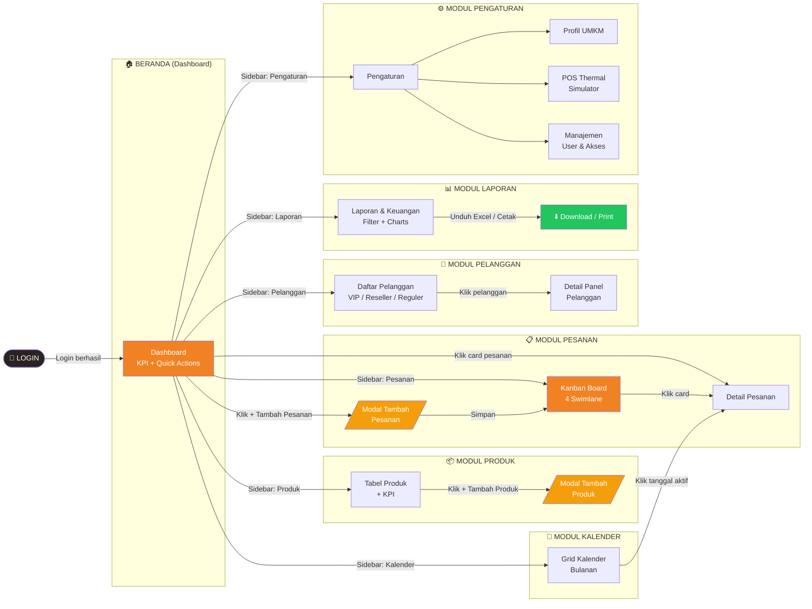

# Mermaid Diagrams — SISFOR BERKAT DINASTI
## Section 4.3 – 4.8

---

## 4.3 Site Map

---

## 4.4 User Flow — Tambah Pesanan

---

## 4.5 User Flow — Cek Deadline Pengiriman

---

## 4.6 User Flow — Cek Pemasukan & Laporan

---

## 4.7 User Flow — Kelola Pelanggan

---

## 4.8 Wireflow — Navigasi Antar Halaman

